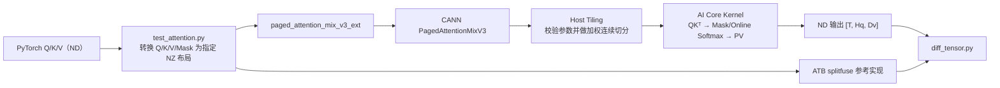

# Ascend_operator：PagedAttentionMixV3

面向 **Ascend 310P** 的 Ascend C 自定义算子工程。当前仓库的主要实现是 `PagedAttentionMixV3`，覆盖：

- Host 侧 Shape 校验与 Tiling；
- AI Core 上的 Paged Attention Kernel；
- 自定义 OPP 编译、打包与安装；
- PyTorch / torch-npu C++ 扩展；
- 与 ATB `_npu_paged_attention_splitfuse` 的正确性回归和性能对比。

> 本文按 **2026-07-12 当前 `atb_style` 工作树**整理。项目脚本中仍有作者容器内的固定 CANN 路径、设备号和工作目录，首次部署请先检查后再执行。

## 1. 当前状态

当前实现采用 **head-major Q、per-Q-head task、128-token Q slice**：

| 项目 | 当前实现 |
|---|---|
| 目标芯片 | `ascend310p` |
| Q 逻辑布局 | `[Hq, T, Dq]`，head-major |
| Q 物理格式 | `FRACTAL_NZ` / torch-npu format `29` |
| Q 物理 token stride | `RoundUp(T, 16)` |
| 输出布局 | ND `[T, Hq, Dv]` |
| Task 粒度 | 一个 Q head × 当前请求中最多 128 个连续 Q token |
| Q 尾块 | `mActual = realQBlockRows`，`roundM = RoundUp(mActual, 16)` |
| KV tile | 代码按 `min(page_size, 128)` 计算；Host 当前限制 `page_size <= 128`，因此一个计算 tile 对应一个物理 page |
| GQA | `Hq % Hkv == 0`，且 `Hq / Hkv <= 16` |
| Softmax | 跨 KV tile 的在线 Softmax |
| Core 调度 | Host 按可见 KV tile 数进行加权、连续任务切分，最多使用 32 个 AI Core |
| L1 优化 | 128 KiB K/V reuse cache，最多缓存 8 个 tile |
| UB 优化 | 232 KiB 固定 arena；R4 剩余空间缓存当前 Batch 的 `block_table` |
| 输出优化 | BMM2 分子保持 `[vBlock][row][C0]`；P12B 将最终 `fp16` 归一化与 ND 转换融合，并以 row-wise multi-burst MTE3 写回 |
| 流水优化 | P13A 对首个 KV tile pair / steady-state 做模板特化；`OutputReuseFlag` 允许下一 Task 前置计算与上一 Task 的 MTE3 写回重叠 |
| 当前回归 | `test_attention.py::main()` 共 11 个用例 |

`query_rope` 和 `alibi_mask` 已保留在接口中，但当前 Kernel **没有实际使用**。

## 2. Profiler 基准摘要（final67）

本版文档的性能基准固定采用：

```text
../profiler_attention_final67
```

> 本轮按指定口径只使用 final67，不与同级目录中的其他采样轮次混算；数据来自已有 Profiler CSV，并非在本次 README 更新过程中重新采集。

固定 Shape：

```text
B = 2
seq_lengths = [64, 192]
kv_lengths  = [80, 432]
Hq = 32
Hkv = 4
Dq = Dv = 128
page_size = 128
output = [256, 32, 128]
PROFILE_REPEAT = 10
Block Dim = 8
```

10 次平均结果：

| 对比项 | 平均耗时 | 结论 |
|---|---:|---|
| 自研 `PagedAttentionMixV313` | `264.3550 us` | 单 Kernel |
| ATB attention core | `301.3717 us` | 自研降低 `37.0167 us`，约 `12.28%`，约 `1.140×` |
| ATB comparable chain | `323.3008 us` | 自研降低 `58.9458 us`，约 `18.23%`，约 `1.223×` |

其中 ATB comparable chain 为：

```text
MulsF16Kernel
+ PagedAttentionDecoderNzMaskKernel
+ TransdataNzToNdKernel
```

ATB 内部的 Q `TransdataNdToNzKernel` 不计入主对比，因为自研接口接收的 Q 已由调用侧准备为 head-major NZ。完整统计口径、各 Pipe 数据和原始 CSV 路径见 [PagedAttentionMixV3 测试文档](./paged_attention_mix_v3测试文档.md)。

> Profiler 结果只代表该代码快照、软件栈、设备和 Shape，不应直接外推到其他模型或环境。各 Pipe 指标可能重叠，不能相加后当作端到端耗时。

## 3. 执行链路



## 4. 目录结构

```text
Ascend_operator/
├── custom_ops/
│   ├── PagedAttentionMixV3/
│   │   ├── op_host/
│   │   │   ├── paged_attention_mix_v3.cpp          # 注册、Shape 推导、Host Tiling
│   │   │   └── paged_attention_mix_v3_tiling.h     # Tiling 数据结构
│   │   ├── op_kernel/
│   │   │   └── paged_attention_mix_v3.cpp          # Ascend C AI Core Kernel
│   │   ├── torch_extension/
│   │   │   ├── csrc/host/paged_attention_mix_v3_ext.cpp
│   │   │   ├── paged_attention_mix_v3_ext/          # Python 加载器
│   │   │   └── setup.py
│   │   ├── framework/                               # Framework 插件配置
│   │   ├── cmake/                                   # 自定义算子构建工具
│   │   ├── build.sh                                 # OPP 编译/打包入口
│   │   └── run.sh                                   # 一键构建/安装脚本
│   ├── AddCustom/                                   # 最小 Add 自定义算子样例
│   ├── AclNNInvocation/                             # AddCustom aclnn 调用样例
│   └── compile_atb.sh                               # ATB 构建辅助脚本
├── test_op/
│   ├── test_attention.py                            # 11 组正确性回归与 Profiler
│   ├── diff_tensor.py                               # 误差统计
│   ├── run.sh                                       # 一键编译和测试入口
│   └── ascend-transformer-boost/                    # ATB 测试依赖
├── paged_attention_mix_v3开发文档.md
└── paged_attention_mix_v3测试文档.md
```

## 5. 环境要求

| 组件 | 要求或说明 |
|---|---|
| 硬件 | Ascend 310P |
| 系统 | Linux；现有脚本主要面向 AArch64 容器 |
| CANN | 与当前代码兼容的 Ascend Toolkit；作者脚本使用 `8.3.RC2` |
| Python | Python 3 |
| PyTorch | 与 CANN 匹配的 `torch` 和 `torch_npu` |
| 构建工具 | GCC/G++、Make、CMake；OPP 构建建议 CMake `>= 3.19`，扩展要求 `>= 3.18` |
| ATB | 正确性对比和 ATB Profiler 需要 |
| 权限 | 安装自定义 OPP 到系统 CANN 目录通常需要 root 或对应写权限 |

加载环境后建议先检查：

```bash
npu-smi info
cmake --version

python3 - <<'PY'
import torch
import torch_npu

print("torch:", torch.__version__)
print("torch_npu:", torch_npu.__version__)
print("NPU available:", torch.npu.is_available())
PY
```

## 6. 构建与安装

### 6.1 拉取代码

```bash
git clone --recurse-submodules https://github.com/qingyiyi/Ascend_operator.git
cd Ascend_operator
```

### 6.2 加载 CANN 环境

按实际安装位置设置：

```bash
source /usr/local/Ascend/ascend-toolkit/set_env.sh
export ASCEND_HOME_PATH=/usr/local/Ascend/ascend-toolkit/latest
```

如果环境固定在 `8.3.RC2`：

```bash
export ASCEND_HOME_PATH=/usr/local/Ascend/ascend-toolkit/8.3.RC2
export ASCEND_OPP_PATH="${ASCEND_HOME_PATH}/opp"
```

同时检查 `custom_ops/PagedAttentionMixV3/CMakePresets.json` 中的 CANN 路径是否与当前环境一致。

### 6.3 编译并安装自定义 OPP

```bash
cd custom_ops/PagedAttentionMixV3
bash build.sh
```

构建产物通常位于：

```text
build_out/custom_opp_*.run
```

安装示例：

```bash
OPP_PACKAGE="$(find build_out -maxdepth 1 -name 'custom_opp_*.run' | head -n 1)"
"${OPP_PACKAGE}" --quiet --install-path="${ASCEND_OPP_PATH}"
```

安装后重新加载环境：

```bash
source /usr/local/Ascend/ascend-toolkit/set_env.sh
source "${ASCEND_OPP_PATH}/vendors/customize/bin/set_env.bash"

export ASCEND_CUSTOM_OPP_PATH="${ASCEND_OPP_PATH}/vendors/customize"
export LD_LIBRARY_PATH="${ASCEND_CUSTOM_OPP_PATH}/op_api/lib:${LD_LIBRARY_PATH}"
```

如果修改 Kernel 后仍加载旧二进制，可在确认没有其他任务依赖缓存后清理 ATC Kernel Cache：

```bash
rm -rf "${HOME}/atc_data/kernel_cache/"*
```

### 6.4 编译 PyTorch 扩展

```bash
cd torch_extension
python3 setup.py build_ext --force
cd ../../..
```

扩展导入后注册：

```text
torch.ops.npu.paged_attention_mix_v3
```

### 6.5 加载 ATB

当前测试脚本无论是否开启 Profiler，都会执行 ATB splitfuse 作为参考，因此需要：

```bash
source /usr/local/Ascend/nnal/atb/set_env.sh
```

## 7. PyTorch 调用接口

### 7.1 Q 的输入契约

业务侧通常先得到 token-major ND Q：

```text
q_nd: [T, Hq, Dq]
```

传给自定义算子前必须转换为 head-major，再转为 format `29`：

```python
query_head_major = q_nd.permute(1, 0, 2).contiguous()
query_nz = torch_npu.npu_format_cast(query_head_major, 29)
```

逻辑 Shape 为：

```text
[Hq, T, Dq]
```

Kernel 使用的物理顺序可表示为：

```text
[head][Dq / 16][RoundUp(T, 16)][16]
```

因此 Decode 时即使逻辑 `T = 1`，物理 token stride 也是 16；但 `seq_len_per_request` 中仍必须填写逻辑长度 1。

### 7.2 调用示例

```python
import math
import sys

import torch
import torch_npu

sys.path.insert(0, "custom_ops/PagedAttentionMixV3/torch_extension")
import paged_attention_mix_v3_ext  # noqa: F401

output = torch.ops.npu.paged_attention_mix_v3(
    query_nz,
    k_cache_nz,
    v_cache_nz,
    attention_mask_nz,
    block_table,
    kv_lengths,
    seq_len_per_request,
    None,                          # query_rope：当前 Kernel 未使用
    1.0 / math.sqrt(qk_head_size), # softmax_scale
    False,                         # alibi_mask：当前 Kernel 未使用
)
```

输入构造可直接参考 `test_op/test_attention.py`：

- `make_query_nz()`：Q 转 head-major NZ；
- `make_cache_nz()`：K/V cache 转 paged NZ；
- `make_mask_nz()`：Mask 补齐并转 NZ；
- `convert_nd_to_nz()`：NumPy 侧 NZ 重排。

## 8. 接口与 Shape

定义：

```text
B    = 有效 Batch 数
T    = sum(seq_len_per_request)
Hq   = Q head 数
Hkv  = KV head 数
Dq   = Q/K head dim
Dv   = V head dim
P    = page_size
C0   = 16
```

| 参数 | dtype | 逻辑 Shape / 物理布局 | 说明 |
|---|---|---|---|
| `query` | `float16` | 逻辑 `[Hq, T, Dq]`；`FRACTAL_NZ` | Head-major Q |
| `k_cache` | `float16` | `[num_blocks, Hkv * Dq / 16, P, 16]`；`FRACTAL_NZ` | Paged K cache |
| `v_cache` | `float16` | `[num_blocks, Hkv * Dv / 16, P, 16]`；`FRACTAL_NZ` | Paged V cache |
| `attention_mask` | `float16` | `[1, mask_col_size / 16, mask_rows_pad, 16]`；`FRACTAL_NZ` | 当前测试使用 causal mask，屏蔽值 `-10000` |
| `block_table` | `int32` | `[B, pages_per_batch]`；ND | 逻辑 page 到物理 cache block 的映射 |
| `kv_lengths` | `int64` | 一维 NPU ND Tensor，至少 `[B]` | 每个请求的 KV 长度，Host Tiling value-dependent |
| `seq_len_per_request` | `int64` | 一维 NPU ND Tensor，至少 `[B]` | 每个请求的逻辑 Q 长度，Host Tiling value-dependent |
| `query_rope` | `float16`，可选 | ND | 预留，当前忽略 |
| `softmax_scale` | `float` | 标量属性 | 通常为 `1 / sqrt(Dq)` |
| `alibi_mask` | `bool` | 标量属性 | 已注册，当前忽略 |
| 返回值 | `float16` | ND `[T, Hq, Dv]` | Token-major 输出 |

## 9. 约束与校验

当前 Host Tiling / PyTorch 扩展要求：

- 仅注册 `ascend310p`；
- Q/K/V/Mask 为 `float16`；
- `block_table` 为 `int32`；
- `kv_lengths`、`seq_len_per_request` 为 `int64`；
- `T > 0`，每个有效 `seq_len_per_request[i] > 0`；
- `sum(seq_len_per_request) == query.size(1)`，这里是逻辑 T，不是 NZ padding 后长度；
- 每个 `kv_lengths[i] > 0`，且 `kv_lengths[i] >= seq_len_per_request[i]`；
- `Hq % Hkv == 0`；
- `Hq / Hkv <= 16`；
- `P` 是 16 的倍数，且 `P <= 128`；
- `Dq` 是 16 的倍数，且 `Dq <= 256`；
- `Dv` 是 16 的倍数，且 `Dv <= 128`；
- K/V 的 `num_blocks` 和 `page_size` 相同；
- K/V/Mask 的 NZ 最后一维为 16；
- `mask_rows_pad` 是 16 的倍数，且覆盖逻辑 T；
- Mask 列数覆盖每个请求向上取整后的全部 KV page；
- `block_table` 的 Batch 维和列数覆盖有效请求及其 KV page。

当前 Host 不会完整检查 `block_table` 中每个物理 page 索引是否小于 K/V `num_blocks`。错误索引可能导致越界访问，调用侧必须保证合法。

## 10. Host Tiling 与任务调度

### 10.1 Task 顺序

固定：

```text
Batch -> Q head -> Q slice
```

一个 task 对应：

```text
(batch_idx, q_head_idx, q_slice_idx)
```

Q slice 固定最多 128 行：

```text
qSliceNum  = ceil(seqLen / 128)
totalTasks = Σ_batch qSliceNum * Hq
```

尾块：

```text
mActual = min(128, seqLen - qBlockStart)
roundM  = RoundUp(mActual, 16)
```

GM 只读写 `mActual` 行，Cube/NZ 中间布局使用 `roundM`。

### 10.2 加权连续切分

最新代码不再按 task 数量简单均分。Host 为每个 Q slice 估算：

```text
sliceWeight = visibleKvTileCount + 1
```

其中 `visibleKvTileCount` 根据该 slice 实际可见的 KV 范围计算。Host 再把总权重尽量平均地映射到连续 task 边界：

```text
usedCoreNum = min(totalTasks, AIC core 数, 32)
```

每个 Core 的最终范围写入固定 32 项 Tiling 数组：

```text
taskStartPerCore[32]
taskEndPerCore[32]
```

Kernel 只读取自己的 `[taskStart, taskEnd)`，不再在设备端重复扫描所有长度并搜索加权边界。该方案保持任务连续性，也降低不同请求 KV 长度差异造成的负载不均。

## 11. Kernel 关键实现

### 11.1 可见 KV 范围

对于当前 Q slice：

```text
historyKvLen = kvLen - seqLen
visibleKvEnd = historyKvLen + qBlockStart + realQBlockRows
```

Kernel 只遍历当前因果位置可见的 KV tile。

### 11.2 在线 Softmax

每个 KV tile 计算：

```text
score = QKᵀ * softmax_scale + mask
P     = exp(score - row_max)
PV    = P @ V
```

跨 tile 维护行状态：

```text
mNew = max(mOld, mPage)
dm   = mOld - mNew
lNew = lOld * exp(dm) + lPage
ONew = OOld * exp(dm) + PV
```

最后：

```text
output = O / l
```

### 11.3 128 KiB L1 K/V reuse cache

每个 AI Core 额外保留固定 128 KiB L1 arena：

```text
cacheTileCount = min(128 KiB / (K tile bytes + V tile bytes), 8)
```

该 Core 遇到的第一个 `(batch, KV-head group)` 被设为不可变 cache owner。该 owner 的前若干 K/V tile 首次从 GM 填充，之后同组的连续 Q-head/Q-slice task 可直接复用；切换到其他 Batch 或 KV group 后不会覆盖这个缓存，避免热路径中的 cache overwrite 同步。

### 11.4 `block_table` UB cache

R4 放置在线 Softmax 行状态后仍有剩余空间。若当前 Batch 的 KV page 数能够放入该空间，Kernel 会一次性将对应 `block_table` 预取到 UB：

- 对齐部分使用 GM → UB bulk copy；
- 不足 32 字节的尾部逐项补齐；
- 后续每个 tile 从 UB 获取物理 page 索引；
- 放不下时回退到标量 GM 读取。

### 11.5 Q multi-burst GM → L1

当前 task 只有一个 Q head。Q 的多个 `Dq / 16` K block 使用一次 multi-burst `DataCopy` 搬运到 L1，减少每个 K block 单独发起 MTE2 命令的开销；无法满足参数范围时保留通用回退路径。

### 11.6 首个 KV tile pair 模板特化（P13A）

KV tile 以 Ping/Pong pair 进入主流水。最新代码在 pair 入口只判断一次当前 pair 是否包含首个 KV tile，随后分别调用：

```cpp
ProcessKvTilePair<true>(...);   // 首个 pair
ProcessKvTilePair<false>(...);  // steady-state pair
```

`IsFirstKvTile` 作为编译期常量向内联路径传播，减少 BMM1 的 Q 装载、在线 Softmax、输出状态更新和 PV fold 中重复执行的 first-tile 分支。

### 11.7 BMM2 累加与最终输出（P12B）

BMM2 的 L0C → UB 结果以及持久化输出分子统一保持：

```text
[vBlock][row][C0]
```

每个 KV tile 直接按 C0 block 累加，不再逐 tile 做 NZ → ND fold。所有 KV tile 完成后：

1. 将行归一化分母和输出分子转换为 `fp16`；
2. `DivC0BlocksToNdHalf()` 读取 `[vBlock][row][C0]` 分子，在做除法的同时直接写成 `[row][vHeadSize]` ND；
3. 将已经失效的 `outUb` fp32 分子区域复用为 ND half staging，不再单独执行一次 ND pack；
4. 使用 row-wise multi-burst MTE3 写出 `[T, Hq, Dv]`。

### 11.8 Ping/Pong、资源保护与写回重叠

BMM1、Softmax、BMM2、Update 使用 Ping/Pong buffer 和显式 Event 同步。R2+R3 是共享物理 arena，使用 shared-UB guard 管理 Mask、fp32 probability scratch 和 PV chunk 的所有权。

提交最终 MTE3 写出后，代码通过 `OutputReuseFlag`（MTE3 → V 事件）归还 ND half staging 的 ownership token；该 token 只有在 MTE3 已消费完 staging 后才可被等待方取得。下一 Task 不在入口立即等待，因此它的 Q/K 装载、BMM1 和 Softmax 等前置阶段可以与上一 Task 的输出写回重叠；只有当下一 Task 的首个 KV tile 即将第一次覆盖 `outUb` 时才等待该 Flag。这样既保护 ND half staging 不被提前覆盖，又缩短了 Task 间的串行等待区间。最后一个 Task 会在 Kernel 收尾阶段 drain 该事件。

## 12. UB arena

固定总量为 **232 KiB**：

| 区域 | 大小 | 用途 |
|---|---:|---|
| R0 | 32 KiB | Ping score/probability `fp16` |
| R1 | 32 KiB | Pong score/probability `fp16`；最终阶段复用为 `[vBlock][row][C0]` 的 `outF16` |
| R2 + R3 | 64 KiB | Mask、`fp32` probability scratch、PV chunk 的共享 arena |
| R4 | 32 KiB | 在线 Softmax 行状态；剩余空间缓存 `block_table` |
| R5 低位 | 8 KiB | Vector workspace |
| R5 后续 | 64 KiB | 跨 KV tile 持久化的 `fp32` 输出分子；P12B 最终阶段复用其失效区域作为 ND half staging |

代码将输出区域紧跟在 8 KiB workspace 后，使整个 arena 结束于 232 KiB，避开此前在约 248 KiB 位置观察到的地址冲突。

## 13. 正确性测试

### 13.1 推荐运行方式

```bash
cd test_op
set -o pipefail

ASCEND_RT_VISIBLE_DEVICES=0 \
PROFILE_TARGET=none \
TEST_REPEAT=1 \
python3 test_attention.py | tee test_attention.log

PASS_COUNT="$(grep -c 'mix_v3 vs splitfuse Pass!' test_attention.log || true)"
test "${PASS_COUNT}" -eq 11 || {
  echo "Expected 11 passing cases, got ${PASS_COUNT}"
  exit 1
}
```

当前 `main()` 执行 11 个用例：

| # | Batch | 总 Q token | `seq_lengths_host` | `kv_lengths_host` | 覆盖目标 |
|---:|---:|---:|---|---|---|
| 1 | 2 | 256 | `[128, 128]` | `[128, 128]` | 完整 128-row slice、单 KV tile |
| 2 | 2 | 256 | `[64, 192]` | `[80, 432]` | 主 Profile Shape、多 KV tile |
| 3 | 2 | 256 | `[63, 193]` | `[80, 432]` | 非 16 对齐尾块 |
| 4 | 2 | 256 | `[127, 129]` | `[160, 432]` | 127/128/1 边界 |
| 5 | 2 | 256 | `[129, 127]` | `[432, 160]` | Batch 顺序反转后的边界 |
| 6 | 2 | 256 | `[1, 255]` | `[80, 432]` | 一行尾块与 128+127 |
| 7 | 2 | 256 | `[17, 239]` | `[80, 432]` | 小尾块与多 slice |
| 8 | 1 | 1 | `[1]` | `[1]` | Decode：单 Q、单 KV token |
| 9 | 1 | 1 | `[1]` | `[128]` | Decode：单 KV page |
| 10 | 1 | 1 | `[1]` | `[512]` | Decode：多 KV page |
| 11 | 2 | 2 | `[1, 1]` | `[80, 432]` | 多 Batch Decode |

通过判据为：

```text
max(abs(actual - reference))
------------------------------------ < 0.1
max(abs(reference)) + 1e-6
```

> `compare_outputs()` 在 NaN 或数值失败时只打印信息，不会主动抛异常，所以不能仅检查 Python 退出码；必须确认日志中恰好出现 11 条 `mix_v3 vs splitfuse Pass!`。

### 13.2 `test_op/run.sh` 的实际默认行为

当前脚本最终执行：

```bash
ASCEND_RT_VISIBLE_DEVICES=1 PROFILE_TARGET=None PROFILE_REPEAT=1 python test_attention.py
```

也就是默认 **关闭 Profiler**，运行 11 组正确性回归。`PROFILE_TARGET=both PROFILE_REPEAT=10` 仅作为注释命令保留。

该脚本还包含固定路径：

- CANN：`/usr/local/Ascend/ascend-toolkit/8.3.RC2`；
- ATB：`/usr/local/Ascend/nnal/atb`；
- 工作目录：`/root/Ascend_operator/test_op/ascend_work`；
- 设备：`ASCEND_RT_VISIBLE_DEVICES=1`。

在不同容器中请先修改。

## 14. Profiler

### 14.1 建议只采一个固定 Shape

`main()` 有 11 个用例，而 trace 文件名固定为 `mix_v3.json` 和 `atb_splitfuse.json`。完整运行时后续用例可能覆盖同名 trace，因此性能采集建议直接调用单个用例：

```bash
cd test_op
rm -rf profiler_attention

ASCEND_RT_VISIBLE_DEVICES=0 \
PROFILE_TARGET=both \
PROFILE_REPEAT=10 \
PROFILE_WARMUP=3 \
PROFILE_LEVEL=1 \
PROFILE_DIR=profiler_attention \
python3 - <<'PY'
from test_attention import test_paged_attention

test_paged_attention(
    2,
    256,
    512,
    32,
    4,
    128,
    128,
    [64, 192],
    [80, 432],
)
PY
```

### 14.2 环境变量

| 环境变量 | 代码默认值 | 说明 |
|---|---:|---|
| `PROFILE_TARGET` | 空 | `none`、`mix_v3`、`atb`、`splitfuse` 或 `both` |
| `PROFILE_MIX_V3` | `0` | `1` 时单独采集自研算子 |
| `PROFILE_ATB` | `0` | `1` 时单独采集 ATB |
| `PROFILE_REPEAT` | `10` | 正式采集次数 |
| `PROFILE_WARMUP` | `3` | 采集前预热次数 |
| `PROFILE_LEVEL` | `1` | torch-npu Profiler Level：0/1/2 |
| `PROFILE_DIR` | `profiler_attention` | 输出目录 |
| `TEST_REPEAT` | `1` | 未开启 Profile 时完整回归重复次数 |
| `ASCEND_RT_VISIBLE_DEVICES` | 未设置 | NPU 设备选择 |

开启任意 Profile 后，`main()` 会强制只执行一轮 11-case 回归；这也是为什么更推荐使用单 Shape 调用方式。

输出通常包括：

```text
profiler_attention/
├── mix_v3.json
├── mix_v3_tb/
├── atb_splitfuse.json
└── atb_splitfuse_tb/
```

## 15. 开发与重编译

| 修改目标 | 文件 |
|---|---|
| 算子注册、Shape 推导、Host Tiling | `custom_ops/PagedAttentionMixV3/op_host/paged_attention_mix_v3.cpp` |
| Tiling 数据结构 | `custom_ops/PagedAttentionMixV3/op_host/paged_attention_mix_v3_tiling.h` |
| AI Core Kernel | `custom_ops/PagedAttentionMixV3/op_kernel/paged_attention_mix_v3.cpp` |
| PyTorch 参数检查和注册 | `custom_ops/PagedAttentionMixV3/torch_extension/csrc/host/paged_attention_mix_v3_ext.cpp` |
| Python 扩展加载 | `custom_ops/PagedAttentionMixV3/torch_extension/paged_attention_mix_v3_ext/_load.py` |
| 测试与 Profiler | `test_op/test_attention.py` |
| 误差计算 | `test_op/diff_tensor.py` |

推荐流程：

```text
修改 Host/Kernel
  -> bash build.sh
  -> 重新安装 custom_opp_*.run
  -> 重新 source CANN 和 customize/bin/set_env.bash
  -> 必要时清理 ATC Kernel Cache

修改 torch_extension
  -> python3 setup.py build_ext --force

修改测试代码
  -> 直接重新运行 test_attention.py
```

## 16. 常见问题

### 16.1 `build.sh` 输出 `please set env.`

先加载 CANN 并设置：

```bash
source /usr/local/Ascend/ascend-toolkit/set_env.sh
export ASCEND_HOME_PATH=/usr/local/Ascend/ascend-toolkit/latest
```

### 16.2 找不到 `PagedAttentionMixV3`

检查：

```bash
echo "${ASCEND_OPP_PATH}"
echo "${ASCEND_CUSTOM_OPP_PATH}"
echo "${LD_LIBRARY_PATH}"
ls "${ASCEND_OPP_PATH}/vendors/customize"
```

确认自定义 OPP 已重新安装并重新 source 环境脚本。

### 16.3 找不到 `libpaged_attention_mix_v3_ext.so`

重新编译扩展：

```bash
cd custom_ops/PagedAttentionMixV3/torch_extension
python3 setup.py build_ext --force
```

### 16.4 Query 结果错位或 Decode 异常

确认 Q 不是旧的 token-major NZ，而是：

```python
query_nz = torch_npu.npu_format_cast(
    q_nd.permute(1, 0, 2).contiguous(),
    29,
)
```

并确认 `sum(seq_len_per_request)` 使用逻辑 Q token 数，不是 16 对齐后的物理长度。

### 16.5 测试退出码为 0，但没有通过

统计日志：

```bash
grep -c 'mix_v3 vs splitfuse Pass!' test_attention.log
```

完整一轮应为 `11`。

## 17. 已知限制

- 当前仅注册 `ascend310p`；
- 核心输入仅支持 `float16`；
- Q/K/V/Mask 需要调用侧提前准备为指定 NZ 布局；
- `page_size <= 128`、`Dq <= 256`、`Dv <= 128`，并要求 16 对齐；
- `query_rope` 和 `alibi_mask` 当前没有计算效果；
- 正确性对照依赖 torch-npu 私有 ATB 接口，升级软件栈后可能需要适配；
- 测试使用随机 Q/K/V 和随机 `block_table`，未固定随机种子；
- 数值失败不会自动令进程返回非零；
- 一键脚本包含环境相关的绝对路径；
- 完整回归与 Profiler 使用固定 trace 文件名，单 Shape 分析应直接调用单个测试用例。

## 18. 相关文档

- [PagedAttentionMixV3 测试文档](./paged_attention_mix_v3测试文档.md)：final67 的完整 Profiler 数据和统计口径；
- [PagedAttentionMixV3 开发文档](./paged_attention_mix_v3开发文档.md)：历史设计与迭代记录，部分早期布局描述可能已过时；
- [AclNNInvocation README](./custom_ops/AclNNInvocation/README.md)：AddCustom 的 aclnn 调用示例。

涉及当前行为时，以以下源码为准：

```text
custom_ops/PagedAttentionMixV3/op_host/paged_attention_mix_v3.cpp
custom_ops/PagedAttentionMixV3/op_host/paged_attention_mix_v3_tiling.h
custom_ops/PagedAttentionMixV3/op_kernel/paged_attention_mix_v3.cpp
custom_ops/PagedAttentionMixV3/torch_extension/csrc/host/paged_attention_mix_v3_ext.cpp
test_op/test_attention.py
```
